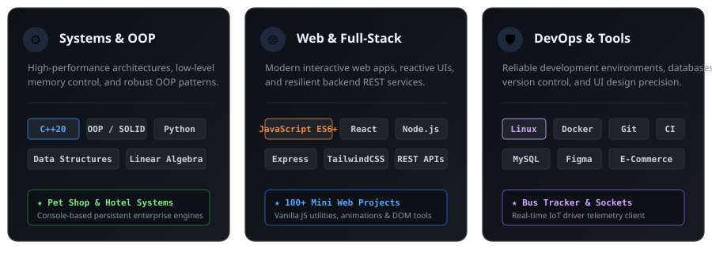

<div align="center" id="top">
  <!-- 100% Self-Hosted Animated Cyber Header (Guaranteed to load globally without filter issues) -->
  
</div>

<br>

<!-- Neofetch / Terminal Architecture Card -->
```bash
nima@systems-arch:~$ neofetch --profile
       /          Developer: Seyyed Nima Rounaghi
      /           Role: Software Engineer & Systems Architect
     /           Academics: Computer Science @ University of Birjand
    /             Venture: Founder @ Megabyte System Development
   /   ,,         Core Engines: C++20 | Modern JavaScript / TypeScript | Python
  /   |  |  -     Algorithms: Contest League Veteran (2024 - 2025)
 /_-''    ''-_    Architecture: Object-Oriented Design, High-Performance Systems & Scalable Web
                   Status: Available for High-Impact Engineering & Global Collaborations
```

<br>

---

## ⚡ Technical Architecture & Engineering Competencies

<!-- 100% Self-Hosted Animated Skills & Architecture Card -->
<div align="center">
  
</div>

<br>

---

## 🚀 Featured Engineering & Production Repositories

<table width="100%">
  <tr>
    <td width="50%" valign="top">
      <h3>🐾 <a href="https://github.com/lxlnimalxl/Pet-Shop-Management-System-CPP">Pet Shop Management System</a></h3>
      <p><b>Core Stack:</b> <code>C++20</code> &nbsp;|&nbsp; <b>Architecture:</b> <code>OOP / SOLID Principles</code></p>
      <p>A full-featured enterprise console system built with rigorous object-oriented paradigms. Implements role-based access (Customer vs. Seller), persistent binary data storage, comprehensive catalog indexing, and real-time transaction workflows.</p>
      <p>
        <a href="https://github.com/lxlnimalxl/Pet-Shop-Management-System-CPP">
          
        </a>
      </p>
    </td>
    <td width="50%" valign="top">
      <h3>🏨 <a href="https://github.com/lxlnimalxl/Hotel-Reservation-System-CPP">Hotel Reservation System</a></h3>
      <p><b>Core Stack:</b> <code>C++</code> &nbsp;|&nbsp; <b>Paradigm:</b> <code>Modular System Architecture</code></p>
      <p>Production-grade hotel booking platform engineered to handle room allocations, multi-tiered pricing calculation engines, customer histories, and administrative management workflows with high runtime performance.</p>
      <p>
        <a href="https://github.com/lxlnimalxl/Hotel-Reservation-System-CPP">
          
        </a>
      </p>
    </td>
  </tr>
  <tr>
    <td width="50%" valign="top">
      <h3>💼 <a href="https://github.com/lxlnimalxl/Portfolio">Personal Developer Portfolio</a></h3>
      <p><b>Core Stack:</b> <code>HTML5</code> <code>CSS3</code> <code>JavaScript ES6+</code></p>
      <p>Modern, responsive personal showcase engineered with custom micro-interactions, clean layout hierarchy, fluid CSS grid/flexbox compositions, and accessible semantic markup.</p>
      <p>
        <a href="https://github.com/lxlnimalxl/Portfolio">
          
        </a>
      </p>
    </td>
    <td width="50%" valign="top">
      <h3>⚡ <a href="https://github.com/lxlnimalxl/html-css-javascript-projects">100+ Mini Web Projects</a></h3>
      <p><b>Core Stack:</b> <code>Vanilla JavaScript</code> <code>DOM APIs</code> <code>CSS3</code></p>
      <p>An extensive collection of over 100 mini applications, algorithmic components, canvas experiments, dynamic calculators, and custom UI widgets built from pure vanilla JavaScript.</p>
      <p>
        <a href="https://github.com/lxlnimalxl/html-css-javascript-projects">
          
        </a>
      </p>
    </td>
  </tr>
  <tr>
    <td width="50%" valign="top">
      <h3>🚌 <a href="https://github.com/lxlnimalxl/University-Bus-Tracker-Driver-Client-">University Bus Tracker Driver Client</a></h3>
      <p><b>Core Stack:</b> <code>JavaScript</code> <code>Geolocation APIs</code> <code>IoT Telemetry</code></p>
      <p>Specialized driver-side telemetry client designed for campus transit tracking, streaming vehicle position coordinates to centralized transit dispatch systems.</p>
      <p>
        <a href="https://github.com/lxlnimalxl/University-Bus-Tracker-Driver-Client-">
          
        </a>
      </p>
    </td>
    <td width="50%" valign="top">
      <h3>💬 <a href="https://github.com/lxlnimalxl/WebSocket-Direct-Chat-Client-Vanilla-JS">WebSocket Direct Chat Client</a></h3>
      <p><b>Core Stack:</b> <code>WebSocket API</code> <code>Vanilla JS</code> <code>Real-Time Networking</code></p>
      <p>Zero-dependency direct real-time communication interface built on raw WebSocket event lifecycles, connection heartbeat monitors, and instant message rendering.</p>
      <p>
        <a href="https://github.com/lxlnimalxl/WebSocket-Direct-Chat-Client-Vanilla-JS">
          
        </a>
      </p>
    </td>
  </tr>
</table>

<br>

---

## 🛠️ Complete Technology Matrix

#### 💻 Systems & Languages


#### 🌐 Frameworks, Engines & Libraries


#### ⚙️ Infrastructure, DevOps & Design Tools


<br>

---

## 📬 Direct Contact & Engineering Network

Always open to technical inquiries, collaboration on complex system architectures, and engineering team roles:

<div align="center">
  <a href="mailto:nimarounaghi11@gmail.com">
    
  </a>
  &nbsp;
  <a href="https://www.linkedin.com/in/nima-rounaghi/">
    
  </a>
  &nbsp;
  <a href="https://t.me/lxlnimalxl">
    
  </a>
</div>

<br><br>

<div align="center">
  <!-- 100% Self-Hosted Animated Cyber Footer -->
  
  <br><br>
  <a href="#top" style="text-decoration: none; color: #58a6ff; font-family: monospace; font-size: 13px;">
    ▲ BACK TO TOP
  </a>
</div>
