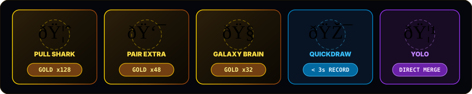
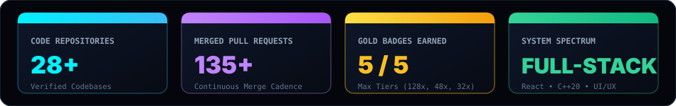
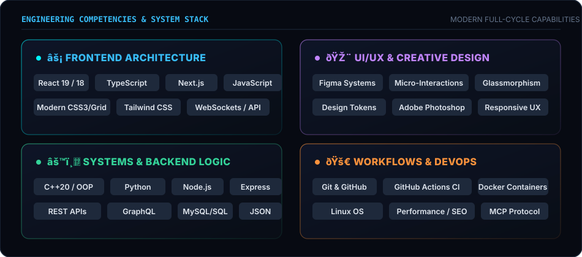

  <!-- 100% Self-Hosted 3D Holographic Hero Banner (Zero External Dependencies) -->
  

    

  <!-- Interactive Quick Links & Direct Connect -->
  

    
    &nbsp;
    
    &nbsp;
    
  

 

---

### Verified GitHub Achievements Showcase

  <!-- 3D Gold Trophy Pedestal Showcase (Zero Broken Unicode) -->
  

 

---

### Repository Activity & Cadence Metrics

  <!-- 100% Self-Hosted Vector Stats Infographic -->
  

 

---

### Technical Radar & Architecture Matrix

  <!-- Bento Grid Technical Matrix -->
  

 

---

### Featured Production Repositories & Engineering Showcases

<table width="100%">
  <tr>
    <td width="50%" valign="top">
      <h3>Pet Shop Management System</h3>
      
<b>Core Stack:</b> <code>C++20</code> &nbsp;|&nbsp; <b>Architecture:</b> <code>OOP / SOLID Design</code>

      
An enterprise-grade console system built with strict object-oriented paradigms, binary file persistence, role-based access control, and real-time transaction processing.

      

        
      

    </td>
    <td width="50%" valign="top">
      <h3>Hotel Reservation Platform</h3>
      
<b>Core Stack:</b> <code>C++</code> &nbsp;|&nbsp; <b>Paradigm:</b> <code>Modular Systems</code>

      
High-performance booking platform handling dynamic room allocation engines, multi-tiered seasonal pricing algorithms, and customer ledger management.

      

        
      

    </td>
  </tr>
  <tr>
    <td width="50%" valign="top">
      <h3>Personal Developer Portfolio</h3>
      
<b>Core Stack:</b> <code>HTML5</code> <code>CSS3 Grid/Flex</code> <code>JavaScript ES6+</code>

      
Modern responsive developer portfolio engineered with fluid typography, dark mode contrast tokens, and accessible semantic UI architecture.

      

        
      

    </td>
    <td width="50%" valign="top">
      <h3>100+ Vanilla Web Labs</h3>
      
<b>Core Stack:</b> <code>Vanilla JavaScript</code> <code>DOM APIs</code> <code>CSS Animations</code>

      
Comprehensive interactive collection of 100+ algorithmic tools, UI component micro-libraries, canvas experiments, and dynamic web calculators.

      

        
      

    </td>
  </tr>
  <tr>
    <td width="50%" valign="top">
      <h3>University Transit Telemetry Client</h3>
      
<b>Core Stack:</b> <code>JavaScript</code> <code>Geolocation APIs</code> <code>IoT Telemetry</code>

      
Driver-side vehicle tracking interface broadcasting real-time GPS coordinates and route status to campus transit dispatch servers.

      

        
      

    </td>
    <td width="50%" valign="top">
      <h3>WebSocket Real-Time Chat Engine</h3>
      
<b>Core Stack:</b> <code>WebSocket Protocol</code> <code>Vanilla JS</code> <code>Event Streams</code>

      
Zero-dependency direct real-time communication interface built on raw WebSocket event lifecycles, connection heartbeat monitors, and instant message rendering.

      

        
      

    </td>
  </tr>
</table>

 

---

  <!-- 3D Horizon Wave Footer -->
  
    
  <a href="#top" style="text-decoration: none; color: #38bdf8; font-family: monospace; font-size: 13px; font-weight: 700;">
    BACK TO TOP
  </a>

